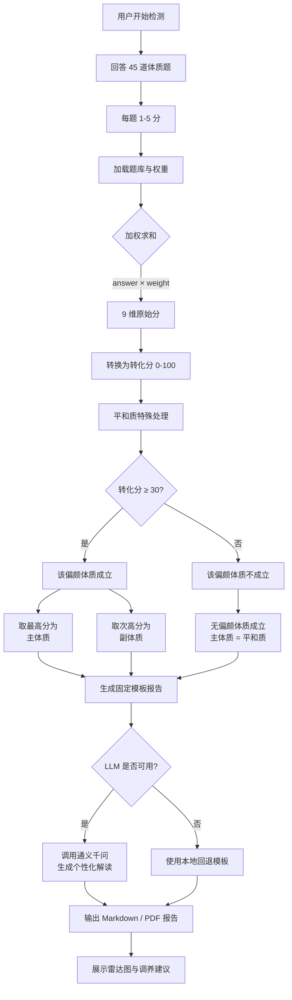

# 中医体质检测 Skill

> AI 时代的中医体质测试 · 60 道题 · 9 大体质 · 雷达图报告

## ✨ 这是什么

基于《中医体质分类与判定》标准的 AI 体质检测工具，
用 45 道题测出用户的 9 大体质倾向（主体质 + 副体质），
生成可视化报告和调养建议。

⚠️ **仅供娱乐参考，不构成医疗建议。**

## 🚀 快速开始

### 方式 1：Web 界面（推荐）

直接在浏览器打开 `web/index.html`：

```bash
# macOS
open web/index.html

# Linux
xdg-open web/index.html

# 或本地起服务
cd web && python3 -m http.server 8080
# 访问 http://localhost:8080
```

功能：
- 60 秒完成 45 道题
- 雷达图可视化
- 自动生成 PDF 报告

### 方式 2：CLI 演示

```bash
# 安装依赖
uv sync

# 运行 CLI 测试
uv run python examples/run-cli.py
```

## 💻 在代码中使用

```python
from skills import ConstitutionScorer, generate_report

# 1. 加载 45 道题
scorer = ConstitutionScorer()

# 2. 用户答案（每题 1-5 分）
answers = [3, 2, 5, 1, 4, 3, 2, 4, 5, 3, 2, 1, ...]  # 45 个数字

# 3. 评分
result = scorer.score(answers)
print(result['main_type'])     # 'qi_deficiency'
print(result['main_score'])    # 68.5
print(result['all_scores'])    # 9 维得分

# 4. 生成报告
report = generate_report(result)
```

## 📁 仓库结构

```
constitution-skill/
├── SKILL.md              # Skill 元数据（给 AI Agent 用）
├── README.md             # 本文件
├── LICENSE
├── questions/             # 5 类 45 道题
│   ├── energy.json        # 精力 / 气虚类（8 题）
│   ├── temperature.json  # 寒热 / 阳虚阴虚类（10 题）
│   ├── moisture.json     # 湿气 / 痰湿湿热类（10 题）
│   ├── emotion.json       # 情志 / 气郁血瘀类（11 题）
│   ├── special.json       # 特禀 / 过敏类（7 题）
│   └── config.json        # 分类映射
├── skills/                # 主代码
│   ├── scoring.py         # 评分逻辑
│   ├── report.py          # 报告生成
│   └── radar.py           # 雷达图
├── assets/
│   └── constitution-data.json  # 9 体质数据
├── output/                # 输出示例
│   └── report-sample.md
└── examples/
    └── run-cli.py
```

## 🎯 9 大体质

| 体质 ID | 中文名 | 特征 | 关键词 |
|---------|--------|------|--------|
| balanced | 平和质 | 健康 | 面色润泽 |
| qi_deficiency | 气虚质 | 容易累 | 乏力 |
| yang_deficiency | 阳虚质 | 怕冷 | 手脚冰凉 |
| yin_deficiency | 阴虚质 | 手脚心热 | 干燥 |
| phlegm_dampness | 痰湿质 | 胖、困倦 | 油腻 |
| damp_heat | 湿热质 | 长痘、口苦 | 黏腻 |
| blood_stasis | 血瘀质 | 脸色暗、痛经 | 瘀斑 |
| qi_stagnation | 气郁质 | 心情差 | 叹气 |
| special | 特禀质 | 过敏 | 鼻炎、荨麻疹 |

## 📊 评分规则

每题 5 选 1（没有=1 / 很少=2 / 有时=3 / 经常=4 / 总是=5），
每题对应 1-2 个体质（权重 0.5-1.0）。

**转换分计算**：`(原始分 - 题目数) / (题目数 × 4) × 100`（国标 ZYYXH/T 157-2009）
**体质成立**：转换分 ≥ 30

返回：主体质 + 副体质 + 9 维雷达图。若所有偏颇体质均不成立（< 30），主体质归为**平和质**。

## 🔄 系统流程图



## 🛠️ 二次开发

### 加新题

```bash
# 编辑 questions/your-category.json
# 更新 questions/config.json
pytest tests/
```

### 接入 AI Agent 平台

参考 `SKILL.md` 中的 metadata，
按 Dify / Coze / Claude MCP 规范注册。

## 📜 许可证

MIT License

## ⚠️ 免责声明

本工具为 AI 体质倾向测试，**仅供娱乐和健康参考**。
**不构成医学诊断、治疗或预防建议。**
如有健康问题，请咨询专业医生。
